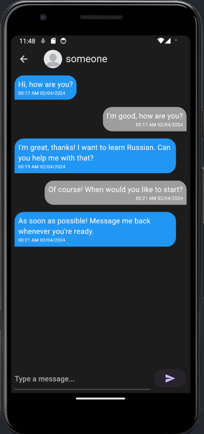
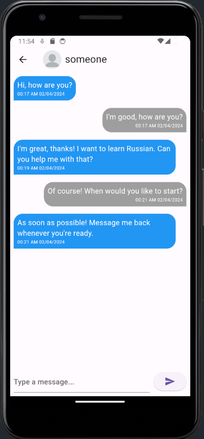
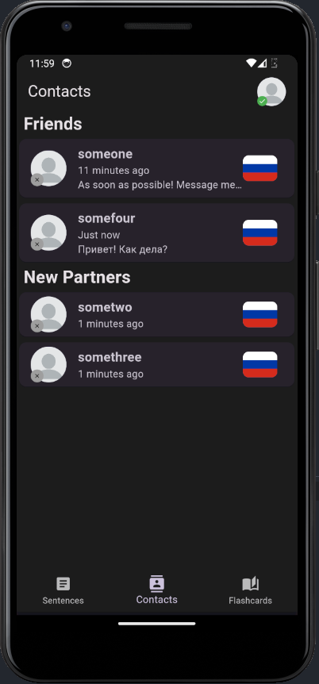
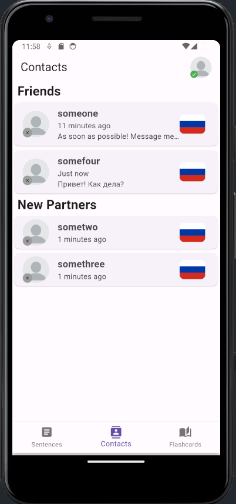
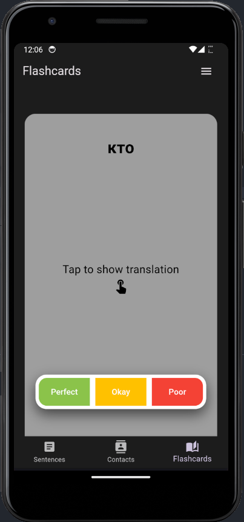
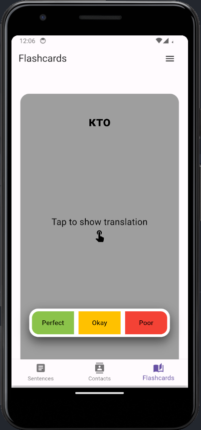
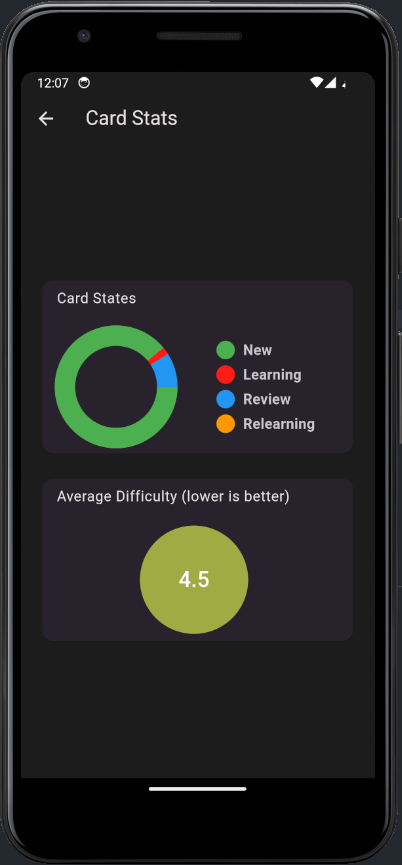
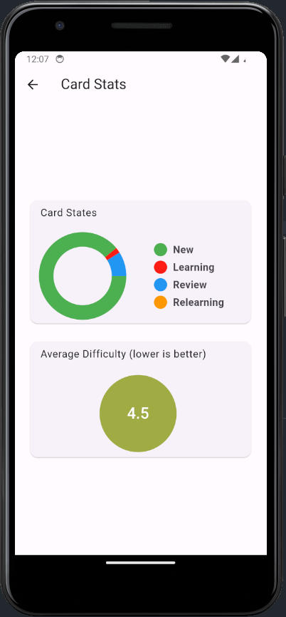
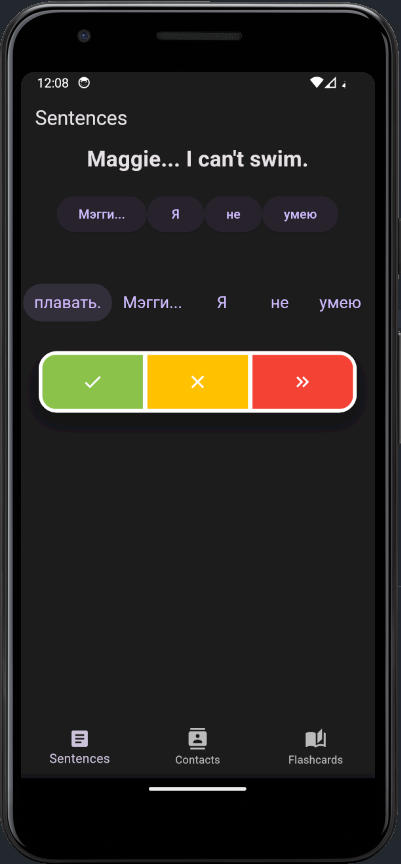
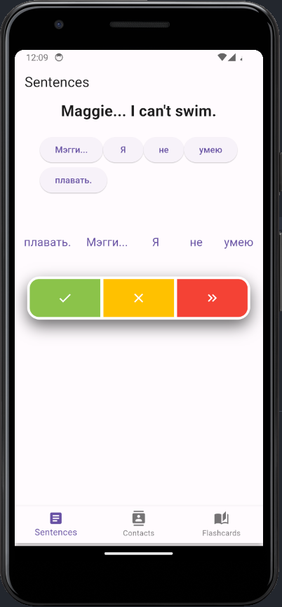

# Final Year Project - Uchi!
Front-end for android application done with Flutter framework as part of the Final Year Project programme for University. The goal of the project is to make an educational language learning app. This app is an umbrella which aims to bring features of apps like Anki and Duolingo and Tandem together. It features flash cards, translation challenges and the ability to make language exchange partners. The back-end can be found on the [fyp_server](https://github.com/DanielSGH/fyp_server) repository.

## Screenshots
Dark                                     |  Light
:---------------------------------------:|:--------------------------------------:
|
|
|
|
|

# Steps to Build and Reproduce
1. Make sure that you have flutter installed before proceeding!
1. Clone, install necessary dependencies and build:
```bash
  git clone https://github.com/DanielSGH/fyp.git &&\
  git clone https://github.com/DanielSGH/fyp_server.git &&\
  cd fyp &&\
  flutter pub get
```
1. Start the backend nodejs server, [instructions are found here](https://github.com/DanielSGH/fyp_server.git) in the README.md
1. Run `flutter run`